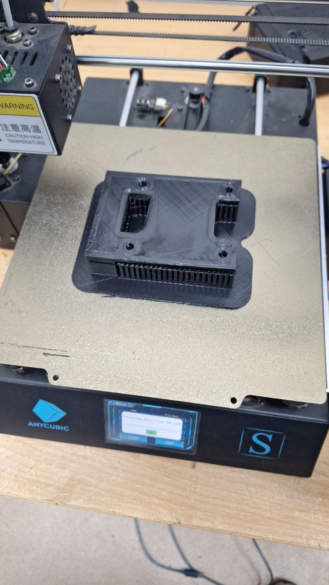
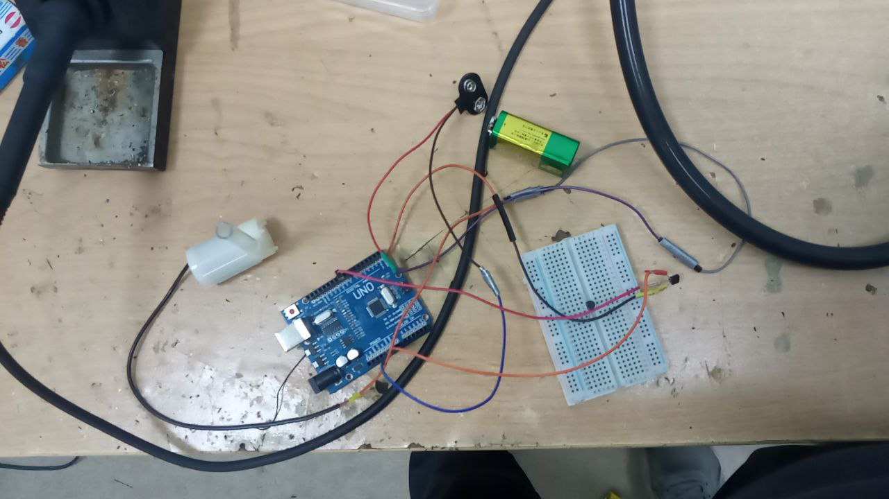

# BRICS Skills Aerial Robotics Hackathon: Autonomous Pesticide Sprayer

## Description

The **Autonomous Pesticide Sprayer** is a drone system designed to automate pesticide spraying in agricultural fields. Its goal is to reduce manual labor, improve precision in spraying, and enhance crop yield. Using GPS and sensors, the drone flies autonomously, avoids obstacles, and sprays pesticides evenly, minimizing chemical waste. A mobile app allows farmers to monitor the process in real-time.

### Problem Solved
Traditional pesticide application is labor-intensive and inefficient, exposing workers to chemicals and leading to uneven spraying. Our drone offers a safer, faster, and more efficient solution.

### Target Users
We aim to help small-to-medium farmers in developing regions, especially within BRICS countries, who face challenges like high labor costs and inefficient crop management.

### Market Analysis
While competitors like **DJI** and **XAG** offer similar products, their high costs limit accessibility for small farms. Our solution is more affordable and tailored to developing markets.

- **Project Lead**: Ruslan Isaev
- **Software Engineer** + **Hardware Engineer**: Nursultan Kurmanbekov

## Task Management Process
Our team follows the **Kanban methodology** to manage project tasks. Each team member is assigned specific tasks, which are organized on a Kanban board with the following stages:

## Table with Task
[https://docs.google.com/spreadsheets/d/1fk5E8hwK-zvWmGShfbh-9VnHwFDglQv1SM98T00Ny1A/edit?usp=sharing](https://docs.google.com/spreadsheets/d/1fk5E8hwK-zvWmGShfbh-9VnHwFDglQv1SM98T00Ny1A/edit?usp=sharing)

## Process

